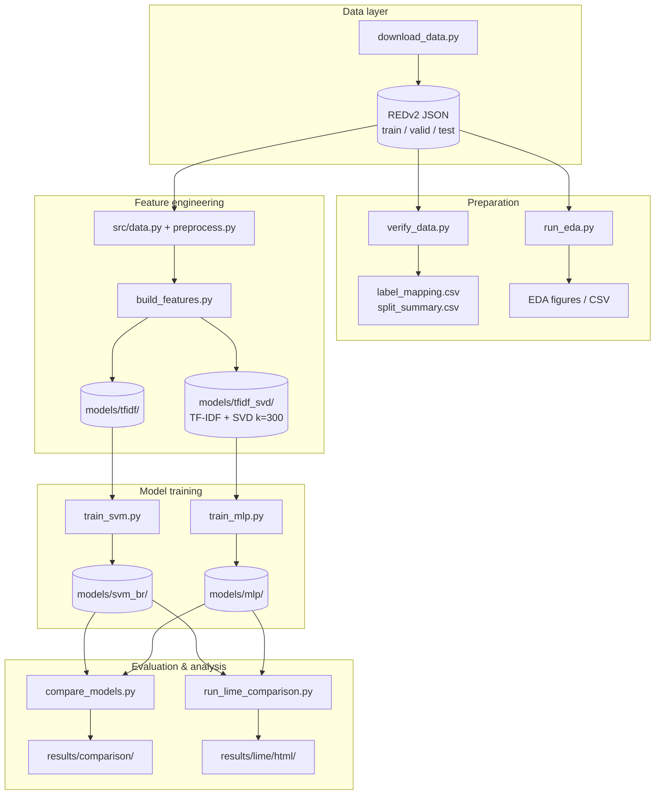
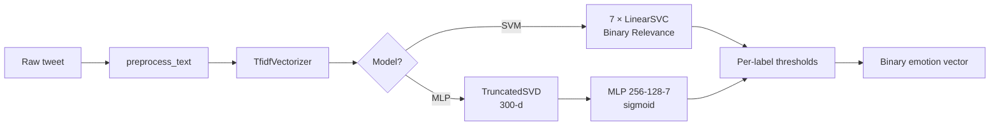

# Multi-Label Romanian Emotion Classification

**Technical documentation for the course paper**  
Multi-Label Romanian Emotion Classification using Statistical and Neural Approaches with Model Interpretability

| Section | Title |
|---------|--------|
| 1 | Problem statement |
| 2 | Proposed solution (theoretical) |
| 2.2 | Dataset — description and analysis |
| 2.3 | Application architecture |
| 3 | Implementation details |
| 4 | Experiments and results |

---

## 1. Problem Statement

### 1.1 NLP task

The application solves **multi-label emotion classification** over **short Romanian texts** (Twitter posts). Given a tweet \(x\), the system predicts which emotions from a fixed set \(\mathcal{L}\) are present. Unlike single-label classification (exactly one class per instance), multi-label learning allows **zero, one, or several** emotions on the same tweet—for example Sadness and Anger together.

**Formal definition.** Each instance is \((x, \mathbf{y})\) with

\[
\mathbf{y} = (y_1,\ldots,y_L)^\top \in \{0,1\}^L, \quad L = 7
\]

where \(y_j = 1\) if emotion \(j\) is present. The goal is to learn

\[
f : \mathcal{X} \rightarrow [0,1]^L
\]

and obtain binary predictions \(\hat{\mathbf{y}}\) via label-specific thresholds \(\tau_j\):

\[
\hat{y}_j = \mathbb{1}[\hat{p}_j \geq \tau_j].
\]

This is a standard **NLP text classification** problem: unstructured text is mapped to a numerical representation, then to label scores.

### 1.2 Why the task is difficult

| Challenge | Description |
|-----------|-------------|
| Language | Romanian morphology, diacritics (ă, â, î, ș, ț), slang, informal social media |
| Imbalance | Neutral and Sadness dominate; Joy and Trust are rarer |
| Multi-label sparsity | ~87% of tweets have one agreed label; ~13% have two or more |
| Annotation | Three annotators; ground truth uses **agreed labels** (≥2 annotators per label) |
| Surface features | Bag-of-words models miss word order, negation, sarcasm |

### 1.3 Scope and objective

The project builds a **reproducible pipeline** on **REDv2** (Romanian Emotion Dataset v2) with:

1. **Method 1:** TF-IDF + Binary Relevance + linear SVM (geometric baseline)  
2. **Method 2:** TF-IDF + Truncated SVD + MLP (non-linear baseline)  
3. **Interpretability:** LIME (local) and linear TF-IDF coefficients (global, SVM)  
4. **Fair evaluation:** same splits, shared TF-IDF (train-fit only), validation tuning, single test report  

Emotion inventory is **REDv2’s seven labels**, informed by Plutchik where they align; **Neutral** is included; **Disgust** and **Anticipation** are not in the corpus.

---

## 2. Proposed Solution

### 2.1 Multi-label strategy: Binary Relevance

Both methods use **Binary Relevance (BR)**: train \(L\) independent binary classifiers \(h_j\), one per emotion. Label co-occurrence is not modeled explicitly but may appear in shared features.

\[
\hat{y}_j = h_j(\phi(x)), \quad \phi(x) = \text{TF-IDF}(x) \text{ or } \text{SVD}(\text{TF-IDF}(x))
\]

### 2.2 Text preprocessing

1. Strip whitespace  
2. Lowercase (diacritics preserved)  
3. Keep placeholders (`<|person|>`, `<|url|>`)  
4. Collapse repeated spaces  

### 2.3 TF-IDF vectorization

For term \(t\) and document \(d\), with sublinear TF and smoothed IDF:

\[
w_{t,d} = \bigl(1 + \log \mathrm{tf}(t,d)\bigr) \cdot \left(\log\frac{N+1}{\mathrm{df}(t)+1} + 1\right)
\]

| Parameter | Value |
|-----------|-------|
| `max_features` | 20,000 |
| `ngram_range` | (1, 2) |
| `min_df` | 2 |
| `max_df` | 0.95 |
| `sublinear_tf` | True |

The vectorizer is **fitted on training tweets only**; validation and test are transformed with the same vocabulary.

### 2.4 Method 1: Binary Relevance + Linear SVM

For each label \(j\), **LinearSVC** learns \(\mathbf{w}_j, b_j\) minimizing regularized hinge loss:

\[
\min_{\mathbf{w}_j, b_j} \frac{1}{2}\|\mathbf{w}_j\|^2 + C \sum_{i} \max\left(0,\, 1 - y_i^{(j)}(\mathbf{w}_j^\top \mathbf{x}_i + b_j)\right)
\]

- **Class weights:** `balanced`  
- **Decision score:** \(s_j(\mathbf{x}) = \mathbf{w}_j^\top \mathbf{x} + b_j\)  
- **\(C\) tuning:** grid \(\{0.01, 0.1, 1, 10, 100\}\), select by **validation macro-F1** (threshold 0 on scores)  
- **Features:** sparse TF-IDF (~14k dimensions on train)  

**Global interpretability:** coefficients \(w_{j,t}\) show which n-grams push toward/away from label \(j\).

### 2.5 Method 2: Truncated SVD + MLP

**Truncated SVD** (LSA) projects sparse \(\mathbf{x} \in \mathbb{R}^{|\mathcal{V}|}\) to \(\mathbf{z} \in \mathbb{R}^{300}\), fit on training TF-IDF only:

\[
\mathbf{X} \approx \mathbf{U}_k \mathbf{\Sigma}_k \mathbf{V}_k^\top, \quad \mathbf{z}_d = \mathbf{x}_d \mathbf{V}_k
\]

**MLP:** hidden layers **256 → 128**, ReLU, output layer 7 units with **sigmoid** \(\sigma\). Training minimizes **binary cross-entropy** (independent labels, BR-consistent):

\[
\mathcal{L} = -\frac{1}{NL}\sum_{i,j}\left[y_i^{(j)}\log\hat{p}_i^{(j)} + (1-y_i^{(j)})\log(1-\hat{p}_i^{(j)})\right]
\]

- **Optimizer:** Adam, \(\eta_0 = 10^{-3}\), `learning_rate='adaptive'`  
- **L2:** \(\alpha = 10^{-4}\)  
- **Early stopping:** validation BCE; restore best weights; patience = 10  
- *Note:* `sklearn.MLPClassifier` has no dropout; regularization is L2 + early stopping + SVD  

### 2.6 Threshold tuning and metrics

**Per-label thresholds** \(\tau_j \in [0.1, 0.9]\) are chosen on the **validation set** to maximize per-label F1, then applied at test time.

| Metric | Role |
|--------|------|
| Micro-F1 | Global F1 over all label decisions |
| Macro-F1 | Mean per-label F1 (rare classes weighted equally) |
| Hamming loss | Fraction of wrong label bits |
| Subset accuracy | Exact match of full label set |

### 2.7 Trivial baseline

**Majority per label** (`DummyClassifier`, BR wrapper): predicts the most frequent class on train for each label independently. Used to verify that SVM/MLP beat a naive strategy.

### 2.8 Interpretability (LIME)

**LIME** fits a sparse linear model locally around each tweet by perturbing words. For 8 curated test cases, explanations are generated per active/predicted label for **both** SVM and MLP, using the same TF-IDF (and SVD for MLP).

---

## 2.2. Dataset Used in the Application — Description and Analysis

### Source

**RED v2** — Ciobotaru et al., LREC 2022.  
Repository: [Alegzandra/RED-Romanian-Emotion-Datasets](https://github.com/Alegzandra/RED-Romanian-Emotion-Datasets)

### Corpus properties

| Property | Value |
|----------|-------|
| Language | Romanian |
| Domain | Twitter |
| Total tweets | 5,449 |
| Labels | 7 (multi-label) |
| Annotation | 3 annotators; **agreed_labels** used (≥2 agree) |
| Anonymization | Usernames removed; proper nouns → `<\|PERSON\|>` |

### Label set and Plutchik mapping

| REDv2 label | In Plutchik’s 8 basic? |
|-------------|------------------------|
| Anger, Fear, Joy, Sadness, Trust, Surprise | Yes |
| Neutral | No |
| Disgust, Anticipation | Not annotated in REDv2 |

JSON label order: `[Sadness, Surprise, Fear, Anger, Neutral, Trust, Joy]`.  
Application column order: `[Anger, Fear, Joy, Sadness, Neutral, Trust, Surprise]`.

### Official splits (used as-is, no deduplication)

| Split | Samples | Multi-label % | Avg. chars |
|-------|---------|---------------|------------|
| Train | 4,088 | 12.8% | 132.1 |
| Valid | 543 | 12.2% | 133.0 |
| Test | 818 | 12.7% | 135.1 |

Duplicate texts exist (1 cross-split train/test, 1 within train, 1 within test); splits match the published benchmark.

### Training-set label distribution (agreed labels)

| Label | Count | % of train |
|-------|-------|------------|
| Neutral | 1,045 | 25.6% |
| Sadness | 820 | 20.1% |
| Anger | 727 | 17.8% |
| Fear | 637 | 15.6% |
| Surprise | 493 | 12.1% |
| Trust | 472 | 11.5% |
| Joy | 435 | 10.6% |

**Mean labels per tweet:** ~1.13 on all splits.

### Co-occurrence (train, selected pairs)

| Pair | Co-count |
|------|----------|
| Fear + Trust | 103 |
| Sadness + Anger | 71 |
| Joy + Surprise | 46 |
| Neutral + Trust | 34 |

Co-occurrence is sparse compared with single-label counts; multi-label modeling remains necessary for ~13% of tweets.

### Tweet length (train / valid / test)

| Statistic | Train | Valid | Test |
|-----------|-------|-------|------|
| Mean | 132 | 133 | 135 |
| Median | 115 | 117 | 116 |
| 90th %ile | 240 | 241 | 245 |

Splits are length-consistent; short texts justify TF-IDF bag-of-words.

### EDA artifacts (generated)

- `results/eda/label_frequencies_train.png`  
- `results/eda/label_cooccurrence_train.png`  
- `results/eda/tweet_length_distribution.png`  
- `results/eda/labels_per_tweet_train.png`  

---

## 2.3. Application

### 2.3.1 System overview

The application is a **batch ML pipeline** (not a deployed web service): scripts load REDv2, fit/transform features, train models, evaluate on test, export metrics and LIME HTML reports.

### 2.3.2 Application diagram



### 2.3.3 Processing flow (single tweet at inference)



### 2.3.4 Repository layout

```
Multi-Label-Romanian-Emotion-Classification/
├── data/redv2/              # REDv2 JSON (gitignored; use download script)
├── docs/                    # Paper documentation
├── models/                  # Saved pipelines and classifiers (gitignored)
├── notebooks/               # Reserved for optional Jupyter work
├── results/                 # Metrics, EDA, LIME, comparison (gitignored)
├── scripts/                 # Runnable entry points
├── src/                     # Core library modules
├── requirements.txt
└── README.md
```

### 2.3.5 Execution order

```bash
pip install -r requirements.txt
python scripts/download_data.py
python scripts/verify_data.py
python scripts/run_eda.py
python scripts/build_features.py          # TF-IDF for SVM
python scripts/build_features.py --svd    # TF-IDF + SVD for MLP
python scripts/train_svm.py
python scripts/train_mlp.py
python scripts/compare_models.py
python scripts/run_lime_comparison.py
```

**Reproducibility:** `RANDOM_SEED = 42` in `src/config.py`.

---

## 3. Implementation — Details

### 3.1 Technology stack

| Library | Version constraint | Purpose |
|---------|-------------------|---------|
| **Python** | 3.11+ | Runtime |
| **NumPy** | ≥1.24 | Numerical arrays |
| **pandas** | ≥2.0 | DataFrames, CSV I/O |
| **SciPy** | ≥1.10 | Sparse matrices |
| **scikit-learn** | ≥1.3 | TF-IDF, SVD, SVM, MLP, metrics, DummyClassifier |
| **matplotlib** | ≥3.7 | EDA and comparison plots |
| **seaborn** | ≥0.13 | Heatmaps (co-occurrence) |
| **joblib** | ≥1.3 | Model serialization |
| **lime** | ≥0.2 | Local text explanations |

### 3.2 Module and function reference

#### `src/config.py`
Project constants: paths, `LABEL_NAMES`, Plutchik flags, TF-IDF/SVM/MLP/LIME hyperparameters, `RANDOM_SEED`, `DEDUPLICATE_TEXTS`.

#### `src/preprocess.py`

| Function | Description |
|----------|-------------|
| `preprocess_text(text)` | Lowercase, strip, normalize placeholders and whitespace |
| `preprocess_texts(texts)` | Batch wrapper |

#### `src/data.py`

| Function | Description |
|----------|-------------|
| `load_raw_split(split)` | Load JSON array for train/valid/test |
| `records_to_dataframe(records)` | Build DataFrame with 7 label columns |
| `load_split` / `load_all_splits` | Load splits; optional deduplication |
| `get_X_y(df)` | Return text list and label matrix |
| `check_duplicates_across_splits` | Duplicate audit |
| `dataset_summary` | Split statistics |
| `verify_labels` | Assert binary labels |
| `label_cooccurrence_matrix` | Co-occurrence counts |
| `export_label_mapping_table` | Plutchik mapping CSV |

#### `src/features.py`

| Function / class | Description |
|------------------|-------------|
| `build_tfidf_vectorizer()` | Configured `TfidfVectorizer` |
| `TfidfFeaturePipeline` | Fit TF-IDF on train; optional SVD; save/load joblib |
| `fit_tfidf_splits` | Convenience fit/transform for all splits |

#### `src/evaluate.py`

| Function | Description |
|----------|-------------|
| `binarize_proba(y_proba, threshold)` | Apply scalar or per-label thresholds |
| `compute_multilabel_metrics(y_true, y_pred)` | Micro/macro F1, Hamming, subset accuracy, per-label table |
| `tune_per_label_thresholds(y_true, y_proba)` | Grid search τⱼ on validation |

#### `src/train_svm.py` (Method 1 core)

| Function | Description |
|----------|-------------|
| `build_linear_svm_br(C)` | `OneVsRestClassifier(LinearSVC)` |
| `build_majority_baseline()` | Per-label `DummyClassifier` |
| `decision_scores(model, X)` | Stack of SVM decision functions |
| `tune_svm_c(...)` | Validation macro-F1 over C grid |
| `train_and_tune(...)` | C tuning + train + threshold tuning |
| `top_tfidf_coefficients(model, feature_names)` | Top ± weights per label |
| `save_svm_artifacts` / `load_svm_artifacts` | Persist model, thresholds, meta |
| `predict_multilabel(model, X, thresholds)` | Binary predictions |

#### `scripts/train_mlp.py` (Method 2 entry)

| Function | Description |
|----------|-------------|
| `load_or_fit_features(...)` | Load `models/tfidf_svd` or fit |
| `build_mlp()` | `MLPClassifier(256, 128)` |
| `train_with_validation_early_stopping(...)` | Warm-start training + val BCE |
| `save_checkpoint(...)` | Save MLP, thresholds, meta.json |

#### `src/lime_explain.py`

| Function | Description |
|----------|-------------|
| `svm_label_predict_proba` / `mlp_label_predict_proba` | LIME-compatible proba for one label |
| `explain_label(...)` | Run `LimeTextExplainer` for one label |
| `select_case_studies(...)` | Pick disagreement / multi-label / Neutral cases |
| `run_lime_comparison(...)` | Batch explanations + HTML export |
| `load_models()` | Load SVM, MLP, both feature pipelines |

### 3.3 Scripts (entry points)

| Script | Role |
|--------|------|
| `download_data.py` | Fetch REDv2 JSON from GitHub |
| `verify_data.py` | Labels, splits, duplicates, mapping CSV |
| `run_eda.py` | Frequencies, co-occurrence, length plots |
| `build_features.py` | Fit/save TF-IDF; `--svd` for TF-IDF+SVD |
| `train_svm.py` | Full Method 1 pipeline + baseline + coef export |
| `train_mlp.py` | Full Method 2 pipeline |
| `compare_models.py` | Side-by-side test metrics and bar chart |
| `run_lime_comparison.py` | 8 case studies, LIME HTML reports |

### 3.4 Saved artifacts

| Path | Content |
|------|---------|
| `models/tfidf/` | `vectorizer.joblib`, `meta.joblib` |
| `models/tfidf_svd/` | vectorizer + `svd.joblib` |
| `models/svm_br/` | `svm_br.joblib`, `thresholds.joblib`, `meta.json` |
| `models/mlp/` | `mlp_classifier.joblib`, `thresholds.npy`, `meta.json` |
| `results/svm_br/report.json` | SVM test/valid metrics |
| `results/mlp/mlp_metrics.json` | MLP test/valid metrics |
| `results/comparison/` | Comparison tables and PNG |
| `results/lime/` | `case_studies.csv`, `lime_feature_weights.csv`, `html/` |

---

## 4. Experiments and Results

### 4.1 Experimental protocol

| Setting | Value |
|---------|-------|
| Data | REDv2 official splits; **no deduplication** |
| Train / valid / test | 4,088 / 543 / 818 |
| Feature fit | Training set only |
| SVM input | Sparse TF-IDF (~14,239 features) |
| MLP input | TF-IDF → SVD, **300** dimensions |
| SVM `C` grid | {0.01, 0.1, 1, 10, 100} |
| Threshold tuning | Validation grid [0.1, 0.9], step 0.05; maximize per-label F1 |
| Test evaluation | **Once**, with validation-tuned thresholds |
| Random seed | 42 |

### 4.2 SVM hyperparameter search (validation)

| C | Macro-F1 | Micro-F1 | Hamming loss |
|---|----------|----------|--------------|
| 0.01 | 0.488 | 0.492 | 0.195 |
| **0.1** | **0.551** | **0.558** | 0.153 |
| 1.0 | 0.538 | 0.555 | 0.135 |
| 10.0 | 0.498 | 0.518 | 0.137 |
| 100.0 | 0.489 | 0.517 | 0.135 |

**Selected:** \(C = 0.1\) (best validation macro-F1).

### 4.3 Test-set results (primary comparison)

| Model | Macro-F1 | Micro-F1 | Hamming ↓ | Subset accuracy |
|-------|----------|----------|-------------|-----------------|
| **SVM (BR + LinearSVC)** | **0.495** | **0.506** | **0.140** | **0.322** |
| MLP (TF-IDF + SVD) | 0.469 | 0.479 | 0.194 | 0.251 |
| Majority baseline | 0.000 | 0.000 | 0.162 | 0.000 |

The **linear SVM outperforms the MLP** on all four aggregate test metrics. Both beat the trivial majority baseline on F1 (baseline predicts only the frequent class per label and achieves 0 micro/macro-F1 on positive detection).

**Validation summary (tuned thresholds):**

| Model | Macro-F1 | Micro-F1 |
|-------|----------|----------|
| SVM | 0.530 | 0.538 |
| MLP | 0.523 | 0.528 |

### 4.4 Per-label F1 on test set

| Label | SVM F1 | MLP F1 | Δ (MLP − SVM) |
|-------|--------|--------|---------------|
| Anger | **0.655** | 0.564 | −0.091 |
| Fear | **0.649** | 0.639 | −0.010 |
| Joy | **0.471** | 0.431 | −0.039 |
| Sadness | **0.451** | 0.393 | −0.057 |
| Neutral | 0.469 | **0.479** | +0.010 |
| Trust | 0.326 | **0.367** | +0.041 |
| Surprise | **0.447** | 0.414 | −0.033 |

SVM is stronger on Anger, Fear, Joy, Sadness, and Surprise. MLP slightly improves Neutral and Trust (higher recall, lower precision on Neutral).

### 4.5 Validation thresholds (examples)

**SVM** (all labels tuned to 0.1 on validation scores): uniform low threshold reflects score scale of LinearSVC.

**MLP** (sigmoid outputs): Anger 0.30, Fear 0.35, Joy 0.25, Sadness 0.55, Neutral 0.10, Trust 0.20, Surprise 0.35.

### 4.6 MLP training

- Best validation BCE: **0.355**  
- Early stopping at epoch **11** (best checkpoint retained from early training chunk)  
- Architecture: 256 → 128 → 7, Adam, batch size 64  

### 4.7 Qualitative results — interpretability

#### Linear SVM coefficients (examples, Anger)

Top positive TF-IDF features for **Anger** include emotionally loaded Romanian terms and profanity, e.g. *dracului*, *nervi*, *urăsc*, *enervat* — linguistically plausible for anger in informal Twitter Romanian.

#### LIME case studies

Eight test tweets were selected (`results/lime/case_studies.csv`) with criteria: **SVM–MLP disagreement**, multi-label, and Neutral-related cases. For each case, HTML reports compare local token attributions per label (`results/lime/html/`).

**Observations from case selection:**

- Models often **disagree** on Neutral vs. a specific emotion (e.g. poetic Sadness tweet predicted Neutral by MLP only).  
- **Disagreement** also appears on Fear/Trust/Anger boundaries on ambiguous short texts.  
- LIME highlights content words and slang; stopwords and URLs sometimes receive weight (known LIME limitation).

Exported: `results/lime/lime_feature_weights.csv`, `results/svm_br/top_tfidf_coefficients.csv`.

#### Comparison figure

Bar chart: `results/comparison/svm_vs_mlp_comparison.png` (macro-F1, micro-F1, subset accuracy).

### 4.8 Discussion

1. **SVM vs. MLP:** For this corpus size and TF-IDF features, a **well-tuned linear model** generalizes better than a shallow MLP on SVD-compressed inputs. Possible causes: limited training data (~4k tweets), early MLP stopping, and information loss in SVD.  
2. **Class imbalance:** Neutral and Sadness dominate; MLP tends toward **high recall / low precision** on Neutral (test recall 0.82, precision 0.34). Threshold tuning partially mitigates this.  
3. **Multi-label:** Low subset accuracy (~0.25–0.32) reflects strict exact-match evaluation; ~13% of tweets are truly multi-label.  
4. **Baselines:** Majority per-label is a weak lower bound (0 F1); future work could add BR with constant probability or label powerset on frequent combinations.  
5. **Limitations (TF-IDF, BR, LIME):** No word order, independent labels, local explanations only — see README Section 4 for the report’s limitations chapter.

### 4.9 Comparison with REDv2 published BERT baselines

REDv2 authors report **subset accuracy ~0.54** with Romanian BERT (classification setting), versus **~0.32 (SVM)** and **~0.25 (MLP)** here. Transformer contextual embeddings outperform bag-of-words on this task; our contribution is an **interpretable classical vs. shallow neural** comparison with shared TF-IDF and LIME/coefficient analysis, not state-of-the-art accuracy.

---

## References

1. Ciobotaru, A., Constantinescu, M. V., Dinu, L. P., & Dumitrescu, S. D. (2022). RED v2: Enhancing RED Dataset for Multi-Label Emotion Detection. *LREC 2022*, 1392–1399.  
2. Ciobotaru, A., & Dinu, L. P. (2021). RED: A Novel Dataset for Romanian Emotion Detection from Tweets. *RANLP 2021*, 291–300.  
3. REDv2 dataset: https://github.com/Alegzandra/RED-Romanian-Emotion-Datasets  
4. Ribeiro, M. T., Singh, S., & Guestrin, C. (2016). “Why should I trust you?” Explaining the predictions of any classifier. *KDD* (LIME).

---

## Appendix: Files to include in the paper

| Figure / table | File |
|----------------|------|
| Label frequencies | `results/eda/label_frequencies_train.png` |
| Co-occurrence heatmap | `results/eda/label_cooccurrence_train.png` |
| Tweet lengths | `results/eda/tweet_length_distribution.png` |
| SVM vs MLP bars | `results/comparison/svm_vs_mlp_comparison.png` |
| Test metrics table | `results/comparison/test_metrics_comparison.csv` |
| Per-label table | `results/comparison/per_label_comparison.csv` |
| Plutchik mapping | `results/label_mapping.csv` |

*Document generated from the implemented pipeline. Metrics reflect the committed codebase with `RANDOM_SEED=42` and `DEDUPLICATE_TEXTS=False`.*
